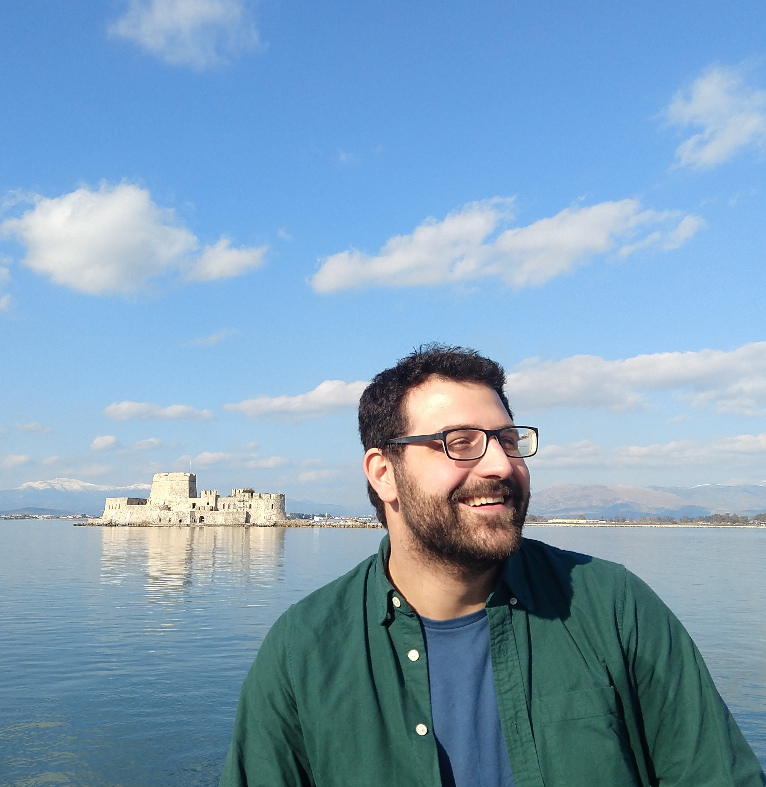

@def title = "nignatiadis"
@def hascode = true
@def hasmath = false

~~~

  

    
    

    Hi! I am Nikos, a final-year PhD student in Stanford's Statistics department, advised by <a href="https://web.stanford.edu/~swager">Stefan Wager</a>. In July 2023, I will be joining the University of Chicago as an assistant professor in the <a href="https://stat.uchicago.edu/"> Department of Statistics</a> and the <a href="https://datascience.uchicago.edu/"> Data Science Institute</a>, after spending a year as a postdoc at <a href="http://stat.columbia.edu/"> Columbia Statistics</a>. 
    </>
    

    I am interested in empirical Bayes methods, causal inference, multiple testing and statistical analysis in the presence of contextual side information, and my research often draws upon nonparametrics and convex optimization. 
    </>
    
 
    Before coming to Stanford, I received degrees in Mathematics (BSc), Molecular Biotechnology (BSc) and Scientific Computing (MSc) at the University of Heidelberg in Germany. There, I worked with <a href="https://www.huber.embl.de/"> Wolfgang Huber </a> at the European Molecular Biology Laboratory.
    

    

     You can find me on <a href="https://github.com/nignatiadis">Github</a>, <a href="https://twitter.com/nikosIgnatiadis">Twitter</a> and <a href="https://scholar.google.com/citations?user=KH3jpkoAAAAJ">Google Scholar</a> or email me at <code>ignat@stanford.edu</code>. A copy of my CV is available <a href="assets/cv/ignatiadis_cv.pdf"> here</a>.
    

    

      
  

~~~
